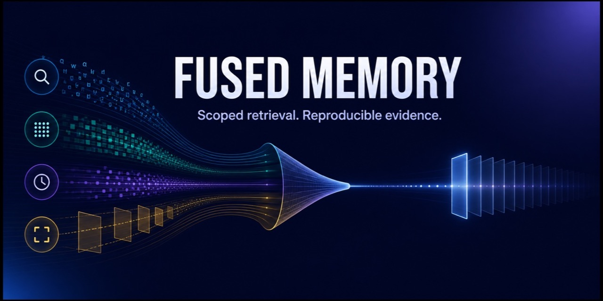

# Fused Memory



[](https://github.com/aalvsz/fused-memory-harness/actions/workflows/tests.yml)
[](LICENSE)

Fused Memory is a downstream-model-agnostic retrieval layer for long-term
agents. It combines dense semantic matching with BM25-style lexical evidence,
then applies application and user scoping, structured-identifier consistency,
source importance, and temporal tie-breaking.

The package is deliberately small: it stores compact event text in an in-memory
index and returns bounded, provenance-labeled entries that any downstream model
can use. It does not require a benchmark, a particular agent framework, or a
cloud service.

## Install

The embedding model is downloaded and cached by FastEmbed on first use.

```bash
git clone https://github.com/aalvsz/fused-memory-harness.git
cd fused-memory-harness
uv sync --extra dev
uv run pytest -q
```

## Use the retriever

```python
from fused_memory_harness import FusedMemoryIndex, FusedMemorySettings

index = FusedMemoryIndex(
    FusedMemorySettings(
        retrieve_top_k=5,
        retrieve_max_chars=1800,
        enforce_identifier_consistency=True,
    )
)

# `event` can be a Google GenAI/ADK event-like object with content, author,
# timestamp, and parts. Scope is always supplied by the caller.
index.store(
    event,
    app_name="my-agent",
    user_id="user-123",
    session_id="session-456",
)

entries = index.retrieve(
    "What medication is recorded for Patient/123?",
    app_name="my-agent",
    user_id="user-123",
    mode="fused",
)
```

Available retrieval modes are `dense`, `bm25`, `fused`, `union`, `rrf`, and
`cascade`. Use `fused` for the normal multi-signal policy. Set
`enforce_identifier_consistency=True` when a query containing a recognized
identifier must not retrieve a nearby record with a different identifier.

## Runtime helpers

`fused_memory_harness.runtime.context_compaction` contains dependency-light
helpers for keeping model context within a character budget. The legacy
SQLite-backed memory controls remain available in
`fused_memory_harness.runtime.legacy_memory` for migration and comparison.

## Repository scope

This repository contains the reusable package and focused unit tests only. The
former benchmark/experiment tree and all experimental result artifacts are not
published. Generated local outputs should remain outside version control.

No production application, patient data, deployment configuration, credentials,
or private repository history is included.

## License

Apache-2.0. See [LICENSE](LICENSE).
